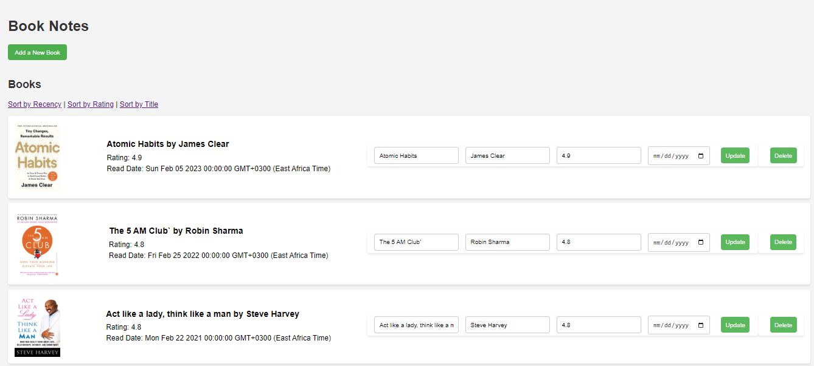
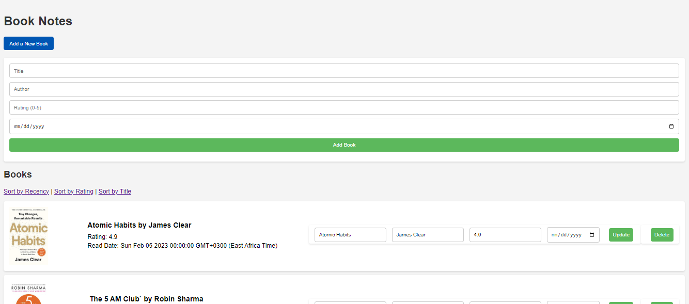

# Book Notes Web Application

## Overview

The Book Notes Web Application is a user-friendly platform that allows users to keep track of the books they've read, along with ratings, read dates, and other details. The app is designed to be simple yet effective, offering sorting functionalities to organize your book collection by recency, rating, or title. It also fetches and displays book cover images using the Open Library API, enhancing the visual appeal of the book entries.

## Demo
Here are some screenshots of the application:

### Home Page


### Add a Book


## Features

- Add a New Book: Users can add new books by entering the title, author, rating, and read date. The app fetches the book cover image from the Open Library API.
- Edit Book Details: Users can update the details of books they’ve already added.
- Delete Books: Users can delete books from their list.
- Sort Books: Books can be sorted by recency, rating, or title.
- Responsive Design: The application is responsive and can be used seamlessly across different devices.

## Technologies Used

- Node.js: Backend JavaScript runtime environment.
- Express.js: Web application framework for Node.js.
- EJS: Embedded JavaScript templates for rendering HTML pages.
- PostgreSQL: Relational database management system for data persistence.
- Axios: Promise-based HTTP client for the browser and Node.js used to interact with the Open Library API.
- Open Library API: Public API to fetch book data and cover images.

## File Structure

- `server.js`: The main server file, handling routes and database operations.
- `views/index.ejs`: The EJS template that renders the HTML structure for the web app.
- `public/css/styles.css`: Contains custom CSS for styling the application.
- `.env`: Environment variables for sensitive data like database credentials.

## Setup and Installation

1. **Clone the Repository**
   ```bash
   git clone https://github.com/saidibraahim/book-notes-app.git
   ```
2. **Install Dependencies**
   ```bash
   npm install
   ```
3. **Setup the Environment Variables**
   - Create a `.env` file in the root directory.
   - Add the following environment variables:
     ```bash
     DB_USER=yourDatabaseUsername
     DB_HOST=yourDatabaseHost
     DB_NAME=yourDatabaseName
     DB_PASSWORD=yourDatabasePassword
     DB_PORT=yourDatabasePort
     ```
4. **Run the Application**
   ```bash
   nodemon server.js
   ```
   The server will start on `http://localhost:3000`.

## How It Works

- **Add Book**: Users can click on the "Add a New Book" button to reveal the form for adding a new book. The form includes fields for the book title, author, rating, and read date. Upon submission, the book is added to the database and the cover image is fetched from the Open Library API.
  
- **Update Book**: Users can edit the details of a book directly from the list. The updated details are saved to the database.
  
- **Delete Book**: Users can delete any book from the list, which removes the entry from the database.

- **Sorting**: The list of books can be sorted by clicking on the sorting options at the top (Recency, Rating, Title).

## Future Enhancements

- User Authentication: Allow users to create accounts and save their personal book collections.
- Book Recommendations: Integrate a feature to recommend books based on user preferences.
- Advanced Search: Implement advanced search functionality to find books based on keywords.

## Contributing

If you would like to contribute to this project, please fork the repository and submit a pull request. Contributions are welcome and greatly appreciated.

## License

This project is licensed under the MIT License. See the [LICENSE](LICENSE) file for details.
```

